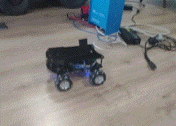
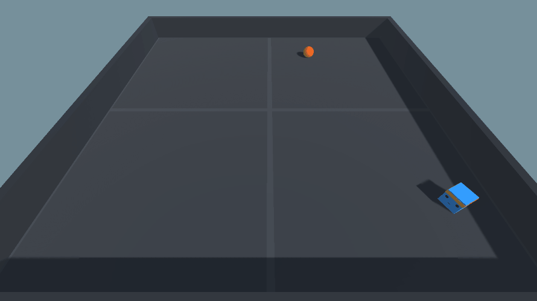
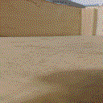
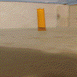
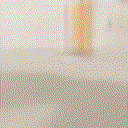
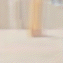
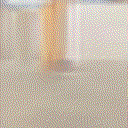
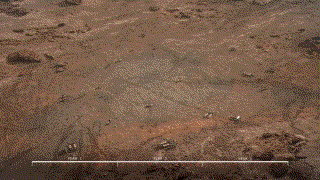
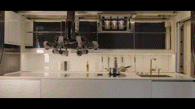

## Our setup 

- [x] [platform](https://aliexpress.ru/item/4000153063891.html)
- [x] [stereocamera](https://aliexpress.ru/item/4001343564945.html)
- [x] [lidar](https://aliexpress.ru/item/32895330424.html)
- [x] [controller](https://aliexpress.ru/item/4000910474677.html)
- [x] Nvidia Jetson Xavier NX

## Visual navigation problem

#### Unity ml-agents as virtual simulation

#### For some simple tasks, neural environment can completely or partially replace the need for training in a virtual simulation

  
Real gifs (recorded with camera)

  
  
  

  
Fake gifs (generated with neural environment based on [this approach](https://github.com/Laggg/neural_env_surviv)):

  
  
  
  
  

## We are inspired by [these](https://www.youtube.com/watch?v=Y75adTBkh2w) [projects](https://www.youtube.com/watch?v=AIrH01N9AsE)

