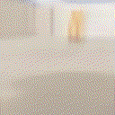

## 0. Building robot

#### Our setup:
  - [x] 1. [platform](https://aliexpress.ru/item/4000153063891.html)
  - [x] 2. [stereocamera](https://aliexpress.ru/item/4001343564945.html)
  - [x] 3. [lidar](https://aliexpress.ru/item/32895330424.html)
  - [x] 4. [controller](https://aliexpress.ru/item/4000910474677.html)
  - [x] 5. Nvidia Jetson Xavier NX

## 1. Navigation problem (like Snake-game/Taxi-game task in 3D)

Real gifs (recorded with camera)

Fake gifs (generated with neural environment based on [this approach](https://github.com/Laggg/neural_env_surviv))

