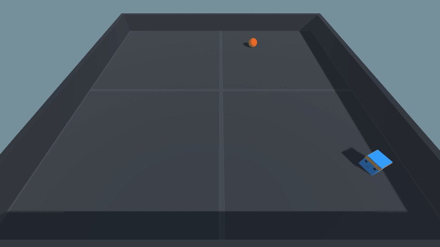

## Installation

  
Ubuntu/MacOS

  
  cd rl-robotics/unity_env/v2
  
  python -m venv unity_venv
  
  source unity_venv/bin/activate
  
  pip install --upgrade pip
  
  pip install mlagents
  
  pip install matplotlib
  
  pip install jupyterlab
  

## Agent trained using ML-Agents

Agent's observations 

Training process of an agent which takes 2 decisions per second

Training process of an agent which takes 25 decisions per second

1. Clone the project using a version control system of your choice.
2. Download and install the [Anaconda](https://www.anaconda.com/products/individual). It is important to select `Just Me` in `Install for:` step and add Anaconda to the path to allow you to use the included batch files.
3. Open `Anaconda Navigator` once to finish up the installation. Just close it when it finishes loading.

Automatic installation using batch file:

4. Run `Install.bat`

Manual installation (If Conda is not in Path and batch files throw errors):

4. Open Anaconda Prompt, navigate to project root using `cd path_to_folder`
5. Run `conda create -n RoboDriver python=3.7`
6. Run `activate RoboDriver`
5. Run `pip install mlagents`
6. Run `pip install matplotlib`
7. Run `pip install jupyterlab`

## Communicating with environment via UnityEnvironment class (LowLevelAPI)

Documentation for [LowLevelAPI](https://github.com/CubeMD/ml-agents/blob/master/docs/Python-API.md), [more LowLevelAPI](https://github.com/CubeMD/ml-agents/blob/master/docs/Python-API-Documentation.md) and [GymWrapper](https://github.com/CubeMD/ml-agents/blob/master/gym-unity/README.md).

Automatic running:
1. Run `start_jupyter_lab.bat`

Manual running (If Conda is not in Path and batch files throw errors):

1. Open Anaconda Prompt, navigate to project root using `cd path/to/folder`
2. Run `activate RoboDriver`
3. Run `jupyter lab`
4. Navigate to notebooks folder and run the notebook

## Unity project structure

To edit agent's settings open RoboDriverAgent prefab

Agent's scene

